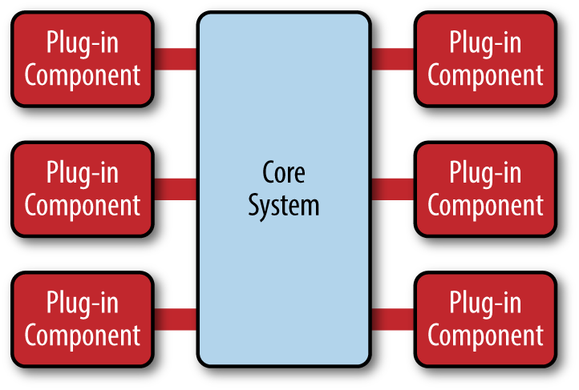

# 软件架构模式

Date: 2022

软件架构是关于如何组织软件的各个部分的学问，合适的架构是软件成功的最重要因素之一。

如果你去研究一些千万行代码量的项目，你会发现其架构都是很简洁的。只有懂架构方面的知识，我们才能排除那些杂七杂八的东西，对软件有一个整体性地认识。

在经典著作《Unix 编程艺术》中有一个观点，人类只能记住七个点，再多一点，人的思维就会开始混乱。同理，当我们去理解一个复杂的软件时，我们应该拨云见日，刨除那些不重要的，直击其架构。

本文会介绍常见的软件架构，并会在每种架构里，列举一些案例以供大家进一步了解学习。本文在撰写的过程中参考了很多文献，我会在文末列出。

### 分层架构

分层架构（Layered architecture）是最常见的软件架构。分层就是把不同的功能放到不同的层级中，层级之间互不干涉，它们通过交互来完成一个复杂的任务。

比如互联网应用的后端中最常见的**展示层-逻辑层-数据层**三层架构。

又比如网络协议栈，这也是一个典型的分层架构。

-   [Layered Architecture](https://www.oreilly.com/library/view/software-architecture-patterns/9781491971437/ch01.html)

### 微内核架构

微内核架构（Microkernel architecture），又被称为插件架构（Plugin architecture)。

其实 Linux 就是微内核架构，微内核架构对内核的代码质量有极高的要求，因为内核作为“功能枢纽”的作用。看看 Linux 内核就知道了，开发者们持续对其进行了大量的优化。（但其实这个也是有争议的，Linux 这个项目已经大到难以区分是宏内核还是微内核了。）

很多操作系统内核都是典型的微内核架构。

例子：

有一个很出名屏幕录制开源软件叫做 OBS Studio，如果你想要获得某些额外功能，那你就需要下载插件，插件就是.so 文件，直接把这个文件放到对应目录中，那么 OBS 就会自动加载该插件，进而把插件的功能提供给用户。这就是典型的插件架构。

在这里我想说一下插件架构。你会发现，很多平台型的应用都是采用了插件架构，比如说 WordPress、Eclipse IDE、Visual Studio Code，这些应用已经超越了一般的专有应用转而成为一个平台，很多开发者专门为其开发功能插件。这也是插件架构的一个好处，那就是可以维护出一个开发者生态。

-   [维基百科词条：Microkernel](https://en.wikipedia.org/wiki/Microkernel)

### 事件驱动架构

事件驱动架构（Event-driven architecture，缩写 EDA），也被叫做隐式调用。

顾名思义，就是通过事件来驱动整个软件的运作的。可能这样说并不好理解，但是你看一个图就明白了。

事件驱动架构的例子非常多：

-   [epoll（Linux 系统调用）](https://en.wikipedia.org/wiki/Epoll)
-   [Vert.x](https://vertx.io/)
-   [Java Swing]()
-   [Node.js](https://www.freecodecamp.org/news/understanding-node-js-event-driven-architecture-223292fcbc2d/)
-   [Kafka](https://kafka.apache.org/)
-   [Netty](https://netty.io/)
-   [Scalable IO in Java](http://gee.cs.oswego.edu/dl/cpjslides/nio.pdf)
-   [Reactor pattern]()
-   [Non-blocking I/O (Java)](<https://en.wikipedia.org/wiki/Non-blocking_I/O_(Java)>)

另外，以太坊的本质也是一个由事件（交易）驱动的分布式状态机。这个是不是也算事件驱动架构呢？

### 面向服务架构

面向服务架构（Service-oriented architecture，缩写 SOA)

-   [Spring Cloud]()
-   [Apache Dubbo]()

适合于面向服务架构软件的消息传递方式：

-   [SOAP]()：SOAP（以前称为“简单对象访问协议”）是用于在分散的分布式环境中交换信息的轻量级协议。
-   [RPC]()：
-   [REST]()：

#### 企业服务总线架构

企业服务总线架构（Enterprise Service Bus architecture，缩写 ESB）是面向服务架构的一种。

-   [维基百科词条：Enterprise service bus](https://en.wikipedia.org/wiki/Enterprise_service_bus)

#### 微服务架构

微服务架构（Microservices architecture）是面向服务架构的升级。

每一个服务就是一个独立的部署单元（separately deployed unit）。这些单元都是分布式的，互相解耦，通过远程通信协议（比如 REST、SOAP）联系。

微服务是近几年非常火的一种软件架构。因为它有很多优点，比如说软件之间的耦合性很低，团队可以分开工作，可以分不同的机器进行部署，大大扩展了服务的容量。

-   [Nginx blog：Introduction to Microservices](nginx.com/blog/introduction-to-microservices/)
-   [Nginx blog：API Gateway](https://www.nginx.com/blog/building-microservices-using-an-api-gateway/)
-   [Nginx blog：Service Discovery](https://www.nginx.com/blog/service-discovery-in-a-microservices-architecture/)

### 云架构

云架构（Cloud architecture）主要解决扩展性和并发的问题，是最容易扩展的架构。

### 单体应用

当然了，还有最简单的就是单体应用（Monolithic application），那就是把所有功能都放在一起。

-   [维基百科词条：Monolithic application](https://en.wikipedia.org/wiki/Monolithic_application)

### MVC 架构

MVC（Model–View–Controller）架构在图形应用中被大量采用。比如说运行在手机上的 App 客户端软件就大量采用这种架构模式。

MVC 还有一个改进的版本叫做 MVVM，它用 VM 来代替 C，这两者有一些细小的差别。

MVC 架构有很多例子：

-   [UIKit]()
-   [SwiftUI]()
-   [React]()
-   [Vue.js]()
-   [Spring MVC]()

## 参考文献

-   [维基百科词条：Software architecture](https://en.wikipedia.org/wiki/Software_architecture)
-   [书：Software Architecture Patterns](https://www.oreilly.com/library/view/software-architecture-patterns/9781491971437/)
-   [阮一峰的个人博客：软件架构入门](https://www.ruanyifeng.com/blog/2016/09/software-architecture.html)
